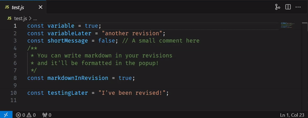
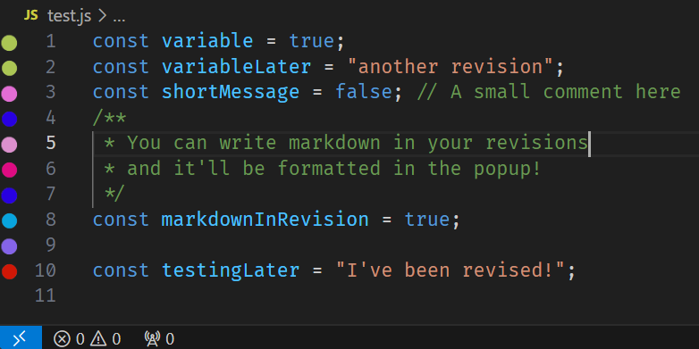
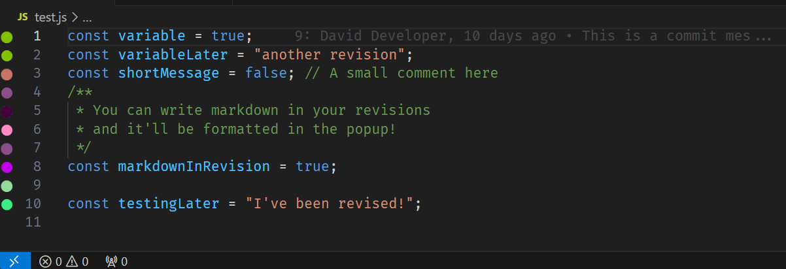
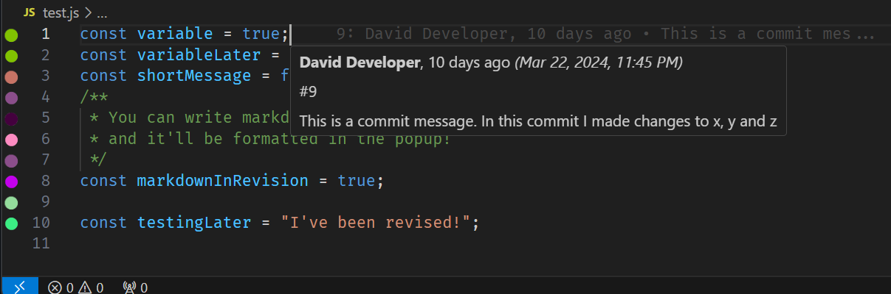
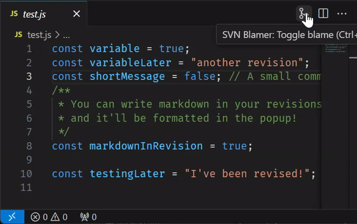

# SVN Blamer

A Visual Studio Code extension to SVN blame files.
When run, this extension will place an icon next to each line of your file. Each icon colour refers to a different revision. Hovering a line will display a tooltip, showing the committer, date, and message. Blame data will also display inline.

## Requirements

**Note**: This extension leverages your machine's SVN installation, so you need to install [SVN](https://subversion.apache.org/) first.

### Windows users

If you use TortoiseSVN, make sure the option Command Line Tools is checked during installation, and C:\Program Files\TortoiseSVN\bin is available in PATH.

## Features

#### Visually identify lines changed by the same revision

#### Display revision information and logs in line

#### Hover line blame to read the full commit log

#### Auto-blame files as you open them

#### Toggle blame from the toolbar

### Secure Authentication

This extension includes a built-in credential manager to handle SVN authentication securely and seamlessly.

**How it works:**

1.  **Automatic Prompt**: If the extension encounters an authentication error (e.g., when blaming a file in a protected repository), it will automatically prompt you to enter your SVN username and password.
2.  **Secure Storage**: Your credentials are encrypted and stored securely using VS Code's native `SecretStorage` API. They are **not** saved in plain text or exposed in settings.
3.  **Per-Repository**: Credentials are stored specifically for each repository root. You can use different credentials for different projects without conflict.
4.  **Auto-Retry**: Once stored, the extension will automatically use these credentials for future operations. If authentication fails again (e.g., expired password), it will prompt you for new credentials.

**Managing Credentials:**

You can manage your stored credentials at any time using the command palette:

1.  Open the Command Palette (`Ctrl+Shift+P` or `Cmd+Shift+P`).
2.  Run the command **SVN Blamer: Clear credentials**.
3.  You will see a list of repositories for which credentials are stored.
4.  Select a specific repository to remove its credentials, or choose **Remove All Credentials** to wipe everything.

## Commands

This extension contributes the following commands to the Command palette.

| Command                            | Description                                                            | Shortcut                                               |
| ---------------------------------- | ---------------------------------------------------------------------- | ------------------------------------------------------ |
| **SVN Blamer - Show blame**        | Blames file, and retrieves log data (if setting is enabled)            | `CTRL + ALT + D` (Windows)  `CTRL + CMD + X` (Mac) |
| **SVN Blamer - Clear blame**       | Clears the applied blame for the active file                           |                                                        |
| **SVN Blamer - Toggle blame**      | Will toggle between fetching blame data and clearing visual indicators | `CTRL + ALT + E` (Windows)  `CTRL + CMD + Y` (Mac) |
| **SVN Blamer - Clear credentials** | Opens a management UI to clear stored credentials for specific repos   |                                                        |

## Configuration

| Setting                      | Description                                                                                                                                                           | Default value |
| ---------------------------- | --------------------------------------------------------------------------------------------------------------------------------------------------------------------- | ------------- |
| **Auto Blame**               | Automatically blames files as you open them.                                                                                                                          | `false`       |
| **Enable Logs**              | Fetches and displays revision log data in the popup.                                                                                                                  | `true`        |
| **Enable Visual Indicators** | Toggle visual indicators that sit to the left of the line number.                                                                                                     | `true`        |
| **Viewport Buffer**          | How many extra lines of blame to load above and below your screen. Increase this if blame icons disappear while scrolling fast. Higher values may impact performance. | `200`         |
| **SVN Executable Path**      | Path to svn executable or alternative command.                                                                                                                        | `"svn"`       |

## Known Issues

-   None known currently. Please report any issues you find!

## Feedback & Contributing

Please report any bugs, suggestions or documentation requests via [issues](https://github.com/BeauAgst/svn-blamer/issues)

Feel free to submit [pull requests](https://github.com/BeauAgst/svn-blamer/pulls)

## Try the New Features Early!

You can use the official **Pre-Release** version to get the latest features early without downloading any files manually.

### How to switch:

1. Open the **Extensions** view in VS Code.
2. Search for this extension.
3. Click the **"Switch to Pre-Release Version"** button.

_You will be automatically updated to the stable version once we release it._
