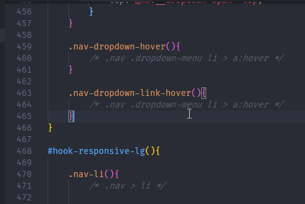

# SVN Gutter
This is the Visual Studio Code version of the [Blamer](https://github.com/BeauAgst/Blamer) plugin, built for Sublime Text. [Pull requests are always welcome!](https://github.com/BeauAgst/blamer-vs/issues/)

## Commands:
This extension contributes the following commands to the Command palette.

`SVN Gutter - Show Blame`: Adds icons to gutter with tooltips containing information from each revision

`SVN Gutter - Clear Blame`: Clears icons and tooltips

## Shortcuts:
Currently only a single keyboard shortcut is available.

**SVN Gutter - Show Blame**
`CTRL + ALT + D` (Windows)
`CTRL + CMD + X` (Mac)

## Features
When run, this extension will place an icon next to each line of your file. Each differently-coloured icon means a different revision. Hovering a line will produce a tooltip, showing the committer, date, and message. 

For example if you're working on a project and you want to see who modified a specific line:

## Requirements
This extension requires that you're either:

* On a Windows machine with Tortoise SVN installed, with command-line tools.
* A Unix machine.

## Extension Settings
**Enable Pips** - By default, the extension displays a coloured pip next to each line number. This can be turned off, whilst still showing the blame information in the tooltip.

## Known Issues
- A little bit slow, because all unique logs have to be retrieved first. ([Issue](https://github.com/BeauAgst/blamer-vs/issues/3))
- Authentication errors [#5](https://github.com/BeauAgst/blamer-vs/issues/5), [#9](https://github.com/BeauAgst/blamer-vs/issues/9)

## Future features
- Automatic blame on file open
- Ideas and contributions always welcome!

## Release Notes

## 0.5.0
- Mac blame shortcut added
- Setting added to disable visual pips [#10](https://github.com/BeauAgst/blamer-vs/issues/10)
- Better error handling, blame indicator in workbench [#3](https://github.com/BeauAgst/blamer-vs/issues/3)

## 0.4.0
- Revision number added to tooltips [#7](https://github.com/BeauAgst/blamer-vs/issues/7)

## 0.3.2
- Fixed decoration issue causing characters to show incorrectly dependant on the language [#6](https://github.com/BeauAgst/blamer-vs/issues/6)

## 0.3.1
- Removed formatting error in decoration caused by conflict with `mailto:`
- Added icon to extension

## 0.3.0
- Linux support added. [#2](https://github.com/BeauAgst/blamer-vs/issues/2)

## 0.2.0
- Added keyboard shortcut
- Fixed readme typo

## 0.1.0
- Initial release